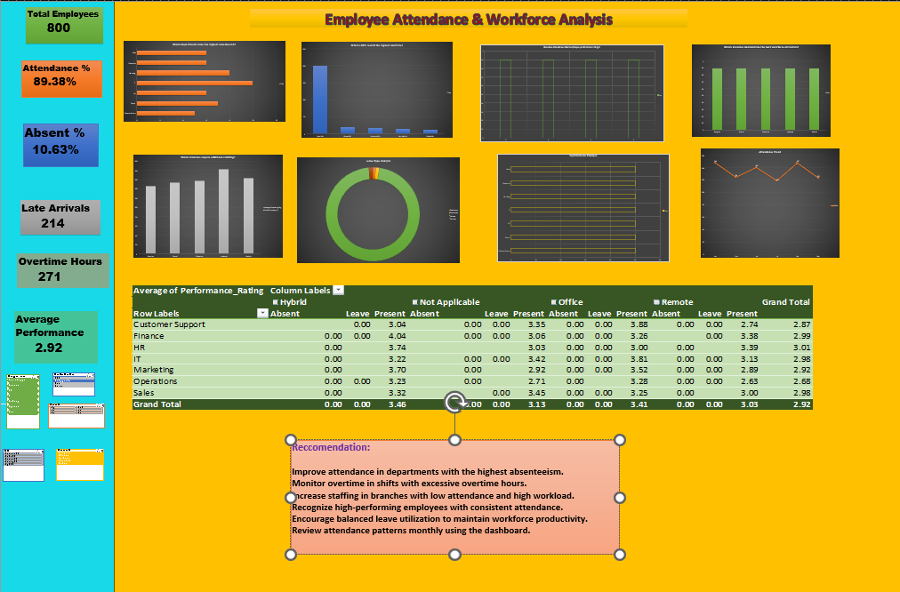

# Employee Attendance & Workforce Analytics

> A Business Intelligence solution developed using **Microsoft Excel, Power Query, Power Pivot, Pivot Tables, and Interactive Dashboards** to analyze employee attendance, absenteeism, overtime, workforce utilization, and HR performance metrics. The solution transforms raw HR data into actionable insights that support workforce planning, operational efficiency, and strategic HR decision-making.

---

# Project Overview

Employee attendance is a key indicator of workforce productivity and organizational efficiency. HR teams require accurate and timely reporting to monitor attendance, manage absenteeism, control overtime, and optimize workforce allocation.

This project presents an end-to-end HR analytics solution that integrates multiple attendance datasets, performs data cleaning and transformation using Power Query, builds a relational data model with Power Pivot, and delivers an interactive Microsoft Excel dashboard for business reporting.

The dashboard enables HR managers and business leaders to monitor workforce performance, identify operational trends, and make informed decisions through data-driven insights.

---

# Business Challenge

TalentCore Solutions Pvt. Ltd. manages employees across multiple departments, branches, and work shifts. Attendance information is maintained across multiple datasets, making it difficult for the HR Operations team to monitor workforce performance and generate timely reports.

The organization requires a centralized analytics solution to:

- Monitor employee attendance across departments and branches.
- Identify absenteeism trends.
- Analyze overtime distribution across work shifts.
- Measure workforce utilization.
- Evaluate attendance performance.
- Support workforce planning and HR decision-making.

---

# Business Solution

This project integrates multiple HR datasets into a unified analytical model and delivers an interactive dashboard that transforms operational attendance data into meaningful business insights.

The solution enables stakeholders to:

- Monitor attendance performance.
- Track absenteeism trends.
- Analyze overtime distribution.
- Evaluate workforce utilization.
- Assess employee performance metrics.
- Support workforce planning and operational decision-making.

---

# Project Objectives

- Analyze employee attendance patterns.
- Measure absenteeism across departments.
- Evaluate overtime trends by work shift.
- Monitor workforce utilization by branch.
- Assess employee performance.
- Support staffing and workforce planning.
- Deliver executive-level HR reporting through interactive dashboards.

---

# Business Questions

The dashboard helps answer key business questions, including:

- Which departments have the highest absenteeism?
- Which branches demonstrate the highest workforce utilization?
- Which work shifts record the highest overtime?
- How does attendance impact employee performance?
- Which departments require workforce optimization?
- What staffing recommendations can improve operational efficiency?

---

# Dataset Information

The analytical model is built using the following datasets:

- Employee Master
- Attendance Transactions
- Department Master
- Shift Master
- Holiday Calendar

These datasets are cleaned, transformed, and integrated to create a unified HR reporting model.

---

# Technology Stack

| Technology | Purpose |
|------------|---------|
| Microsoft Excel | Dashboard Development |
| Power Query | Data Cleaning & Transformation |
| Power Pivot | Data Modeling |
| Pivot Tables | Business Analysis |
| Pivot Charts | Data Visualization |
| Slicers | Interactive Dashboard Filtering |

---

# Project Workflow

```text
Raw HR Data
      │
      ▼
Power Query
(Data Cleaning & Transformation)
      │
      ▼
Power Pivot
(Data Modeling & Relationships)
      │
      ▼
Pivot Tables
(Business Analysis)
      │
      ▼
Pivot Charts
(Data Visualization)
      │
      ▼
Interactive Excel Dashboard
      │
      ▼
Business Insights & Recommendations
```

---

# Data Cleaning & Transformation

Power Query was used to prepare and standardize the data before analysis.

Key activities included:

- Removing duplicate records
- Handling missing values
- Standardizing attendance status
- Standardizing leave types
- Standardizing work modes
- Correcting data types
- Merging multiple HR datasets
- Validating employee records
- Creating calculated columns for analysis

---

# Dashboard Overview

## Executive KPIs

- Total Employees
- Attendance Percentage
- Absenteeism Percentage
- Total Overtime Hours
- Average Performance Rating
- Workforce Utilization

## Analytical Reports

- Department-wise Attendance
- Department-wise Absenteeism
- Monthly Attendance Trends
- Overtime Analysis by Shift
- Workforce Utilization by Branch
- Attendance vs Performance Analysis
- Leave Type Analysis
- Department-wise Employee Distribution

## Interactive Filters

- Department
- Branch
- Month
- Shift
- Work Mode
- Gender

---

# Key Performance Indicators (KPIs)

| KPI | Description |
|------|-------------|
| Total Employees | Total active employees |
| Attendance Percentage | Overall attendance rate |
| Absenteeism Percentage | Overall absenteeism rate |
| Total Overtime Hours | Total overtime hours worked |
| Workforce Utilization | Overall workforce utilization |
| Average Performance Rating | Average employee performance score |

---

# Key Business Insights

The dashboard enables decision-makers to:

- Identify departments with high absenteeism.
- Monitor attendance trends over time.
- Evaluate overtime distribution across shifts.
- Compare workforce utilization across branches.
- Analyze employee leave patterns.
- Assess attendance performance.
- Support staffing and workforce planning.

---

# Business Impact

The solution provides measurable business value by enabling organizations to:

- Improve attendance monitoring.
- Reduce absenteeism through proactive intervention.
- Optimize workforce allocation.
- Monitor overtime effectively.
- Improve HR reporting efficiency.
- Support workforce planning.
- Enhance operational decision-making through data-driven insights.

---

# Project Structure

```text
Employee-Attendance-Workforce-Analytics/
│
├── Data/
│   ├── Raw/
│   └── Cleaned/
│
├── Dashboard/
│
├── Analysis/
│
├── Presentation/
│
├── Screenshots/
│
├── README.md
├── LICENSE
└── .gitignore
```

---

# Dashboard Preview

Add dashboard screenshots to the **Screenshots** folder.

```markdown
()
```

---

# Getting Started

Clone the repository:

```bash
git clone(https://github.com/RAMAPRIYAM268/Talent_Core_Solutions.git)
```

Open the Microsoft Excel workbook.

Enable editing and content if prompted.

Refresh Power Query to load the latest data.

Explore the dashboard using the interactive slicers and filters.

---

# Future Enhancements

- Automated Power Query refresh.
- Integration with Power BI for enterprise reporting.
- Predictive attendance forecasting.
- Employee turnover and retention analysis.
- Department benchmarking.
- Integration with cloud-based HR systems.

---

# Skills Demonstrated

- Business Intelligence
- HR Analytics
- Microsoft Excel
- Power Query
- Power Pivot
- Data Cleaning
- Data Modeling
- Pivot Tables
- Dashboard Development
- KPI Development
- Data Visualization
- Workforce Analytics
- Business Reporting

---

# License

This project is intended for educational and portfolio purposes.

---

# Author

**Ramapriya M**

Aspiring Data Analyst | Microsoft Excel | Power BI | SQL | Python | Streamlit